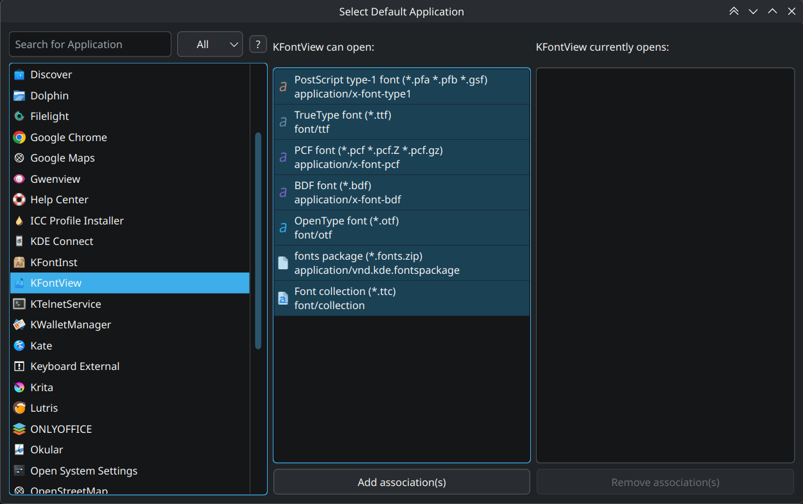
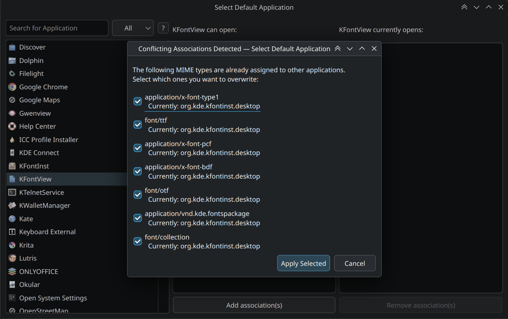

# Select Default Application (Qt6)

A powerful, modern GUI tool to manage default applications on Linux. Built with Qt 6 and C++17, it strictly adheres to the [XDG MIME Apps Specification](https://specifications.freedesktop.org/mime-apps-spec/mime-apps-spec-latest.html), ensuring your file associations work correctly across all desktop environments (KDE Plasma, GNOME, XFCE, Hyprland, i3, etc.).

| Main Interface | Granular Conflict Resolution |
|:---:|:---:|
|  |  |

## Features

### Core Functionality
- **XDG Compliant**: Fully implements the XDG MIME Apps Specification for both reading and writing associations
- **Precedence Handling**: Correctly respects desktop-specific overrides (`$desktop-mimeapps.list`) and system-wide defaults
- **Two-Way Management**:
  - **Add Associations**: Set an application as the default for specific file types
  - **Remove Associations**: Remove explicit user overrides to fall back to system defaults
- **Application-Centric UI**: Select an application to see everything it supports and what it currently handles
- **Visual Feedback**: Full icon support via `QIcon::fromTheme` for both applications and MIME types

### User Experience
- **Granular Conflict Resolution**: When setting associations that conflict with existing defaults, a checkbox dialog allows you to selectively choose which specific MIME types to overwrite
- **Search & Filtering**: Search applications by name and filter MIME types by category (e.g., audio, video, image)
- **Symmetrical Layout**: Clean, balanced three-panel interface with consistent spacing and alignment
- **Default Window Size**: Opens at a comfortable 1000×600 pixels
- **Rich Help Dialog**: HTML-formatted help text with clear instructions

### Developer Features
- **Verbose Logging**: Use `-V` flag with custom `sda.log` category to see only relevant application logs (parsing, associations) without Qt internal noise
- **Clean CLI Exit**: Proper resource cleanup when using `--help` or `--version` flags (no `QThreadStorage` warnings)
- **Modern C++17**: Uses range-based for loops, structured bindings, and Qt 6 best practices

## Installation

### Prerequisites

You need **Qt 6**, **CMake**, and a **C++17** compatible compiler.

#### Fedora / RHEL
```bash
sudo dnf install qt6-qtbase-devel cmake gcc-c++
```

#### Ubuntu / Debian
```bash
sudo apt install qt6-base-dev cmake g++
```

#### Arch Linux
```bash
sudo pacman -S qt6-base cmake gcc
```

### Building from Source

1.  **Clone the repository**:
    ```bash
    git clone https://github.com/tenshou170/selectdefaultapplication-Qt6.git
    cd selectdefaultapplication-Qt6
    ```

2.  **Configure and Build**:
    ```bash
    cmake -S . -B build
    cmake --build build
    ```

3.  **Run**:
    ```bash
    ./build/sda-qt6
    ```

4.  **Optional: Install** (installs to `/usr/local/bin` by default):
    ```bash
    sudo cmake --install build
    ```

## Usage

### GUI Workflow
1.  **Left Panel**: Browse or search for an application
2.  **Center Panel**: View MIME types the selected application can handle
    *   **Bold** entries = already set as default for this app
    *   Select types you want to associate → click **"Add association(s)"**
3.  **Right Panel**: View current default associations for the selected app
    *   Select types → click **"Remove association(s)"** to revert to system defaults

### Conflict Resolution
When setting associations that conflict with existing defaults, a dialog will appear showing:
- Each conflicting MIME type
- Its current default application
- Checkboxes (checked by default) to selectively choose which to overwrite

Simply **uncheck** any associations you want to preserve.

### Command Line Arguments

- `-h`, `--help`: Display help information
- `-v`, `--version`: Display application version (2.0)
- `-V`, `--verbose`: Enable verbose logging (shows XDG parsing, association writes/removals)

**Example**:
```bash
# Run with verbose logging to debug MIME type parsing
./build/sda-qt6 -V
```

## Technical Details

### Architecture
This project uses a clean separation between UI and backend logic:

- **`XdgMimeApps` Class**: Handles all XDG specification logic
  - Parses `~/.config/mimeapps.list`, `$XDG_CONFIG_DIRS`, and desktop-specific overrides
  - Discovers `.desktop` files from all XDG application directories
  - Handles `[Default Applications]`, `[Added Associations]`, and `[Removed Associations]` groups
  - Writes user overrides to `~/.config/mimeapps.list` only (never modifies system files)

- **`SelectDefaultApplication` Class**: Qt widget for the UI
  - Three-panel layout with application list, MIME type list, and current defaults
  - Delegates all file I/O and parsing to `XdgMimeApps`

### Custom Logging
Uses `QLoggingCategory("sda.log")` for all debug output. When `-V` is set:
```
sda.log: XdgMimeApps: Parsing "/home/user/.config/mimeapps.list"
sda.log: XdgMimeApps: Writing setting: "image/png" = "gwenview.desktop"
sda.log: SelectDefaultApplication: Sync-ed 235 associations to UI
```

### Cross-Desktop Compatibility
Works seamlessly across all freedesktop.org-compliant desktops:
- **KDE Plasma, GNOME, XFCE, Cinnamon** (traditional DEs)
- **Hyprland, Sway, i3, bspwm** (Wayland/X11 window managers)
- No KDE Frameworks dependency—only pure Qt 6 Core/Gui/Widgets

## File Structure

**Main source files:**
- `main.cpp` - Application entry point
- `selectdefaultapplication.{h,cpp}` - UI implementation
- `xdgmimeapps.{h,cpp}` - XDG MIME specification backend
- `CMakeLists.txt` - Build configuration

## License

This project is licensed under the **GNU General Public License v3.0** (GPLv3). See the [LICENSE](LICENSE) file for details.

## Credits

This is a Qt 6 port and modernization of the original [selectdefaultapplication](https://github.com/magnus-ISU/selectdefaultapplication) by [magnus-ISU](https://github.com/magnus-ISU). This fork includes significant enhancements:
- Ported from Qt 5 to Qt 6
- Modern C++17 codebase
- Granular conflict resolution dialog
- Improved UI symmetry and layout
- Custom logging infrastructure
- Clean command-line handling
- Enhanced XDG specification compliance

Special thanks to the original author for creating this useful tool!

## Contributing

Contributions are welcome! Please ensure your changes:
- Follow the existing code style (see `.clang-format`)
- Maintain XDG specification compliance
- Include appropriate error handling
- Update documentation as needed